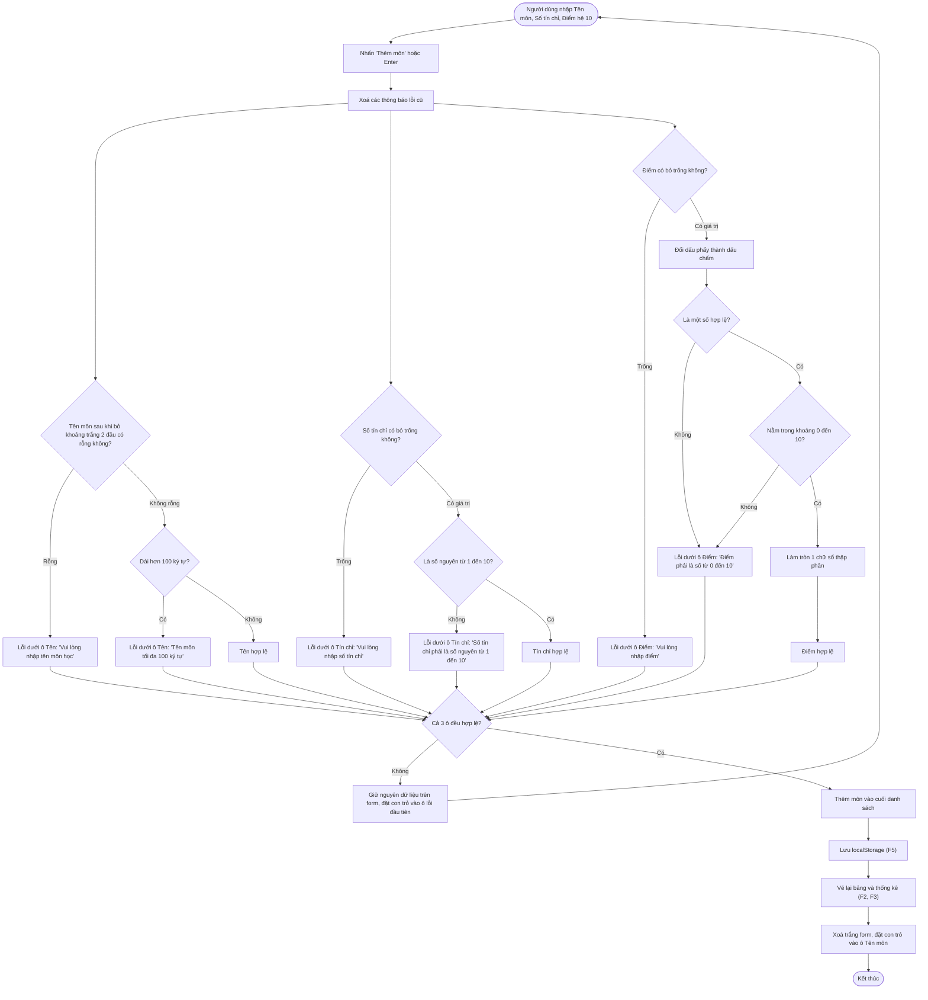
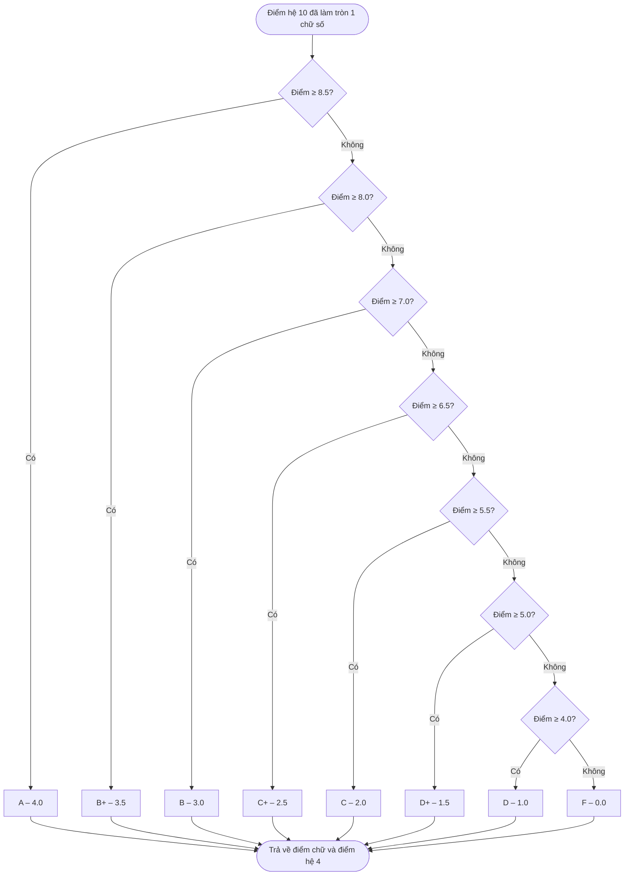
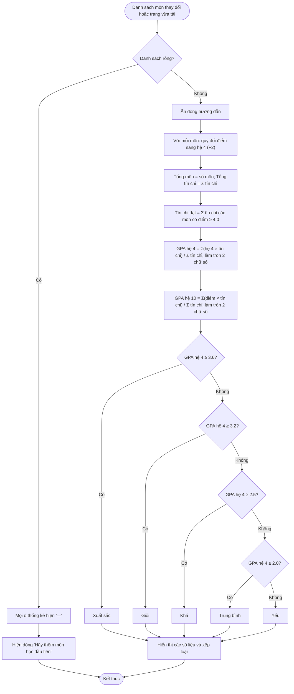
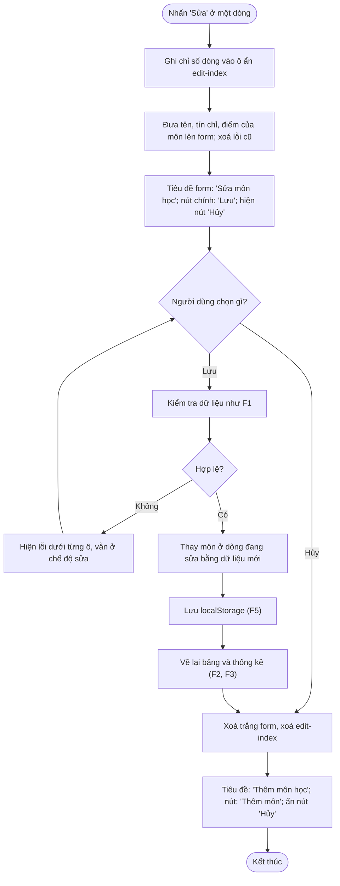
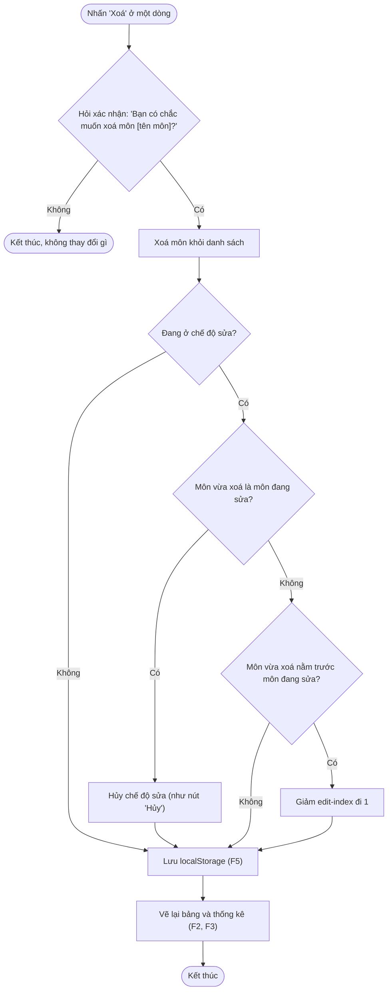
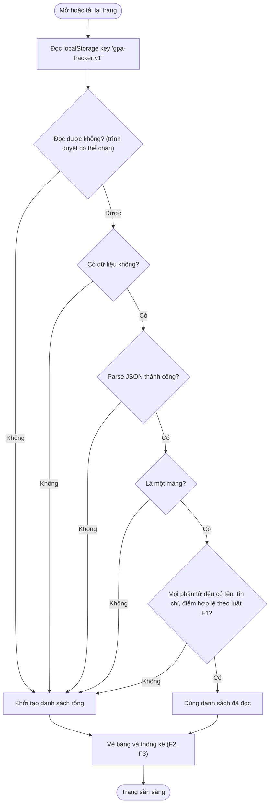
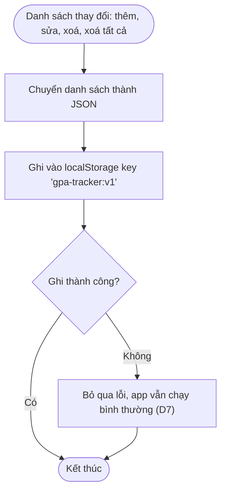
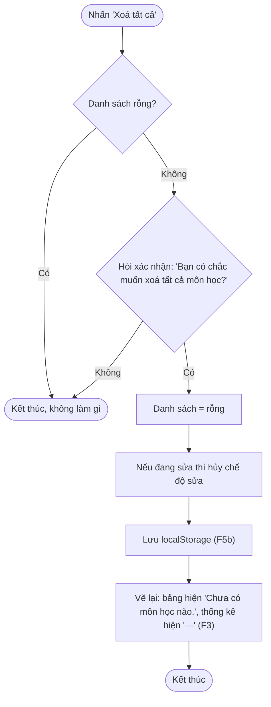

# DESIGN – GPA Tracker

Thiết kế luồng nghiệp vụ cho từng chức năng F1–F5, dựng từ [PRD.md](PRD.md).
Mỗi flowchart là căn cứ để cài đặt và viết unit test ở giai đoạn 3.

## Mô hình dữ liệu

Mỗi môn học là một object:

```js
{ name: "Toán Giải tích", credits: 3, score: 8.5 }
```

- `name`: chuỗi đã bỏ khoảng trắng 2 đầu, 1–100 ký tự.
- `credits`: số nguyên 1–10.
- `score`: số 0–10, đã làm tròn 1 chữ số thập phân.
- Điểm chữ và điểm hệ 4 **không lưu**, luôn tính lại từ `score` (F2), để dữ liệu không bị lệch.
- Danh sách môn là một mảng, lưu trong localStorage key `gpa-tracker:v1` (F5).

## Quy ước thiết kế (làm rõ những chỗ PRD chưa nói)

| # | Quy ước | Lý do |
|---|---------|-------|
| D1 | Điểm hệ 10 được làm tròn 1 chữ số **trước** khi quy đổi. Ví dụ `8,45` → `8.5` → A. | Bảng F2 chỉ có mốc 1 chữ số (8.4 / 8.5), làm tròn trước thì không có điểm nào rơi vào khe giữa hai mốc. |
| D2 | Xếp loại dùng GPA hệ 4 **đã làm tròn 2 chữ số** (đúng con số người dùng nhìn thấy). | Tránh trường hợp màn hình hiện 3.60 mà xếp loại lại là Giỏi. |
| D3 | Tín chỉ đạt = tổng tín chỉ các môn có điểm hệ 10 ≥ 4.0 (tức là không phải F). | Theo PRD F3. |
| D4 | Số tín chỉ có phần thập phân (ví dụ `2.5`) hoặc bỏ trống là lỗi. | PRD yêu cầu số nguyên. |
| D5 | Đang sửa một môn mà xoá chính môn đó thì form tự hủy chế độ sửa. Xoá môn khác thì vẫn giữ chế độ sửa, chỉ số dòng đang sửa được cập nhật lại. | Tránh lưu đè vào sai dòng. |
| D6 | Danh sách rỗng thì "Xoá tất cả" không làm gì (không hỏi xác nhận). | Không có gì để xoá. |
| D7 | Ghi localStorage bị lỗi (trình duyệt chặn, đầy bộ nhớ) thì app vẫn chạy tiếp, chỉ không lưu được. | PRD F5: không được làm hỏng trang. |
| D8 | Cho phép trùng tên môn (ví dụ học lại). | PRD không cấm. |

## F1 – Thêm môn học



Cả 3 ô được kiểm tra cùng lúc, nên ô nào sai thì đều hiện lỗi dưới ô đó trong một lần bấm.

## F2 – Quy đổi điểm



Quy đổi chạy mỗi khi vẽ một dòng trong bảng (cột Điểm chữ và GPA hệ 4) và khi tính GPA (F3).

## F3 – Tính GPA và xếp loại



Vì mỗi môn có ít nhất 1 tín chỉ, danh sách không rỗng thì Σ tín chỉ luôn > 0, không có phép chia cho 0.

## F4 – Sửa và xoá môn học

### F4a – Sửa môn



### F4b – Xoá môn



## F5 – Lưu dữ liệu

### F5a – Tải dữ liệu khi mở trang



Dữ liệu hỏng thì bỏ qua toàn bộ, không giữ lại một phần, để không hiện ra dữ liệu sai lệch.

### F5b – Ghi dữ liệu sau mỗi thay đổi



### F5c – Xoá tất cả



## Ánh xạ sang module (cho giai đoạn 3)

| Module | Nội dung | Flowchart |
|--------|----------|-----------|
| `src/validation.js` | Kiểm tra tên, tín chỉ, điểm; trả về dữ liệu đã chuẩn hoá hoặc lỗi theo từng ô | F1, F4a |
| `src/grading.js` | Quy đổi điểm hệ 10 → chữ → hệ 4 | F2 |
| `src/gpa.js` | Tính tổng môn, tín chỉ, tín chỉ đạt, GPA, xếp loại | F3 |
| `src/storage.js` | Parse/serialize, đọc/ghi localStorage an toàn | F5a, F5b |
| `src/main.js` | Gắn sự kiện vào DOM có sẵn, vẽ bảng, chế độ sửa, xác nhận xoá | F1, F4, F5c |

Bốn module đầu là logic thuần, không đụng tới DOM, nên test được bằng Vitest mà không cần giả lập trình duyệt.
