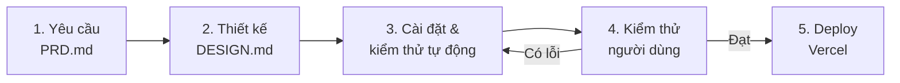

# PLAN – GPA Tracker

Dự án làm theo **mô hình thác nước (Waterfall)**. Các giai đoạn thực hiện tuần tự.
Một giai đoạn chỉ bắt đầu khi giai đoạn trước đã đạt tiêu chí hoàn thành.
Trạng thái thực tế được ghi trong [STATUS.md](STATUS.md).

## Giai đoạn 1 – Yêu cầu
- **Đầu vào:** ý tưởng sản phẩm.
- **Sản phẩm:** `PRD.md` gồm chức năng F1–F5, quy tắc kiểm tra dữ liệu, bảng quy đổi điểm, xếp loại và yêu cầu phi chức năng.
- **Tiêu chí hoàn thành:** PRD được chốt, không còn câu hỏi mở.

## Giai đoạn 2 – Thiết kế luồng nghiệp vụ
- **Đầu vào:** `PRD.md`.
- **Sản phẩm:** `DESIGN.md` chứa flowchart theo cú pháp Mermaid cho từng luồng:
  - F1 Thêm môn học (nhập → kiểm tra dữ liệu → thêm, hoặc báo lỗi dưới từng ô)
  - F2 Quy đổi điểm hệ 10 → điểm chữ → hệ 4
  - F3 Tính GPA hệ 4/hệ 10 và xếp loại (gồm trường hợp danh sách rỗng)
  - F4 Sửa môn (đưa lên form → Lưu/Hủy) và xoá môn (có xác nhận)
  - F5 Lưu/tải localStorage (gồm trường hợp dữ liệu hỏng) và "Xoá tất cả"
- **Tiêu chí hoàn thành:** mỗi chức năng có flowchart, mọi nhánh lỗi trong PRD đều được thể hiện, người dùng duyệt thiết kế.

## Giai đoạn 3 – Cài đặt & kiểm thử tự động
- **Đầu vào:** `DESIGN.md`, `index.html` (giao diện có sẵn).
- **Sản phẩm:** mã nguồn trong `src/` (`main.js`, `style.css`, các module logic) và unit test Vitest.
- **Thứ tự cài đặt** (theo phụ thuộc trong PRD): F1 → F2 → F3 → F4 → F5.
- **Tiêu chí hoàn thành:** `npm test` đạt toàn bộ, `npm run build` thành công, các phần logic chính đều có test.

## Giai đoạn 4 – Kiểm thử người dùng (UAT)
- **Người thực hiện:** chủ dự án (không phải Claude).
- **Đầu vào:** bản chạy bằng `npm run dev` hoặc `npm run preview`.
- **Sản phẩm:** kết quả kiểm thử và danh sách lỗi (nếu có), ghi vào `STATUS.md`.
- **Tiêu chí hoàn thành:** người dùng xác nhận đạt. Nếu có lỗi thì quay lại giai đoạn 3.

## Giai đoạn 5 – Deploy lên Vercel
- **Đầu vào:** bản đã qua UAT.
- **Sản phẩm:** URL công khai trên Vercel, ghi vào `STATUS.md`.
- **Tiêu chí hoàn thành:** URL truy cập được, app chạy đúng trên điện thoại (≥ 360px) và máy tính.
